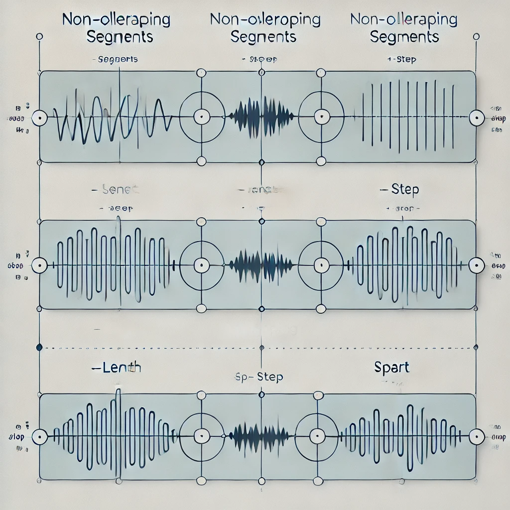

# Mission
Shortcut in Neovim to record audio and insert text at cursor (in both insert and normal mode).


# whisper neovim
- [whisper.vim - Vim plugin for speech-to-text · ggerganov/whisper.cpp · Discussion #108](https://github.com/ggerganov/whisper.cpp/discussions/108)
- [Neovim AI tools: gp.nvim, groq, groq-whisper and supermaven are insanely good. : r/neovim](https://www.reddit.com/r/neovim/comments/1g26n0x/neovim_ai_tools_gpnvim_groq_groqwhisper_and/)
  - [supermaven-inc/supermaven-nvim: The official Neovim plugin for Supermaven](https://github.com/supermaven-inc/supermaven-nvim)
    - [Supermaven: Free AI Code Completion](https://supermaven.com/)
      - copilot
      - Pro: $10 / mo with 1 mio context window, "Adapts to your coding style"
      - [https://hn.algolia.com/?q=supermaven](https://hn.algolia.com/?q=supermaven)

```
cd ~/github
git clone https://github.com/ggerganov/whisper.cpp
cd ~/github/whisper.cpp
# https://github.com/ggerganov/whisper.cpp#nvidia-gpu-support
cmake -B build -DGGML_CUDA=1
cmake --build build -j --config Release
./build/bin/stream --threads 8 -m ~/github/whisper.cpp/models/ggml-small.bin --step 350 --length 1000
```

In `whisper.cpp` what do the `--length` and `--step` parameters actually do?

- https://github.com/ggerganov/whisper.cpp/issues/354#issuecomment-1372724842
- https://chatgpt.com/share/6756f0b1-0f94-8005-abaf-bb57b240c765
  - `--length` is the segment length
  - `--step` is sliding window, resulting in overlap if step < length
  - useful for continuous speech

ChatGPT image is BS, but looks cool:




# whisper streaming
- [Whisper (Whisper.cpp/WhisperKit) for live transcription - why no prompt caching? : r/LocalLLaMA](https://www.reddit.com/r/LocalLLaMA/comments/1h2kvu2/comment/lzkbq4u/)
  - https://github.com/SYSTRAN/faster-whisper
  - https://github.com/fedirz/faster-whisper-server?tab=readme-ov-file


# docker nvidia gpu
```
curl -fsSL https://nvidia.github.io/libnvidia-container/gpgkey | sudo gpg --dearmor -o /usr/share/keyrings/nvidia-container-toolkit-keyring.gpg   && curl -s -L https://nvidia.github.io/libnvidia-container/stable/deb/nvidia-container-toolkit.list |     sed 's#deb https://#deb [signed-by=/usr/share/keyrings/nvidia-container-toolkit-keyring.gpg] https://#g' |     sudo tee /etc/apt/sources.list.d/nvidia-container-toolkit.list
sudo apt-get update
sudo apt-get install -y nvidia-container-toolkit
sudo nvidia-ctk runtime configure --runtime=docker
cat /etc/docker/daemon.json 
sudo systemctl restart docker
```

```
docker run --rm --gpus=all --publish 8000:8000 --volume ~/.cache/huggingface:/root/.cache/huggingface fedirz/faster-whisper-server:latest-cuda
```

```
mise use --global websocat
ffmpeg -loglevel quiet -f alsa -i default -ac 1 -ar 16000 -f s16le - | websocat --no-close --binary 'ws://localhost:8000/v1/audio/transcriptions?language=en
```
via https://github.com/fedirz/faster-whisper-server/blob/cbb6c9284f626a7e708d5db8505297419a99154a/examples/live-audio/script.sh#L17
